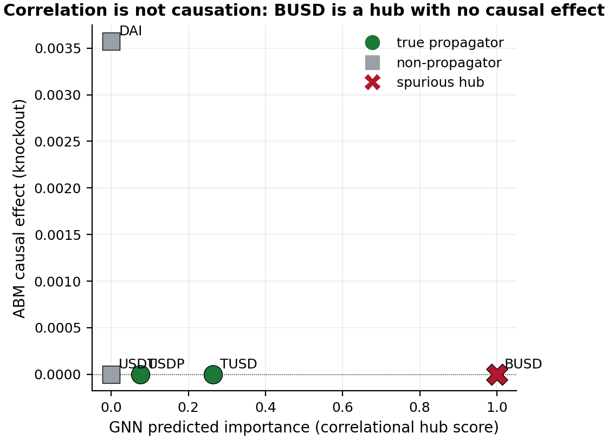
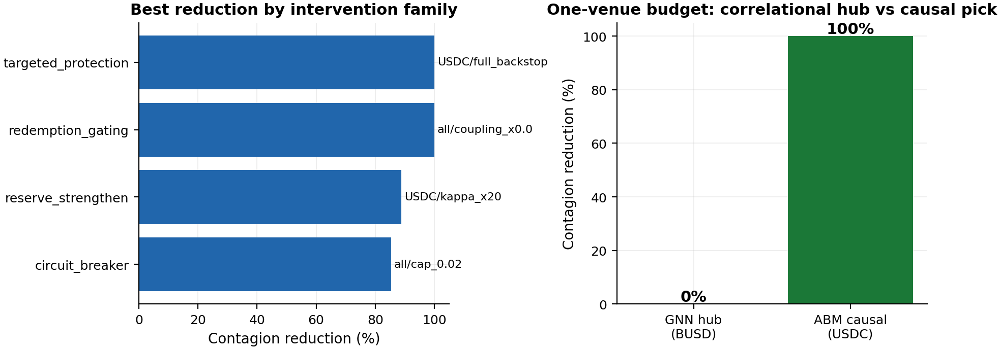
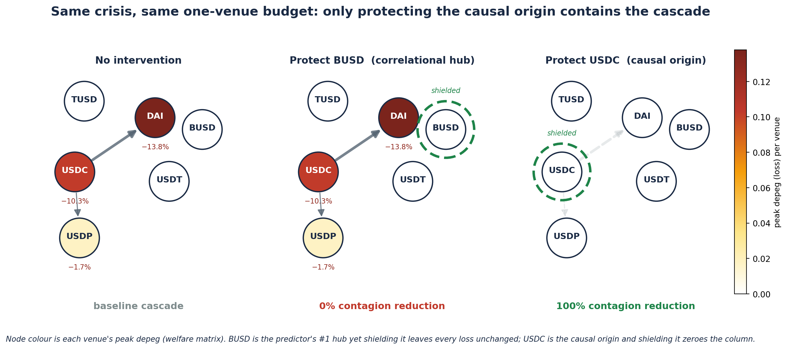

# stablecoin-abm

[](https://github.com/nl2992/ICAIF_stablecoin-abm/actions/workflows/ci.yml) [](LICENSE) [](environment.yml)

<p align="center">
  
</p>

<p align="center"><em>Correlational GNN hub ranking → calibrated agent-based counterfactual: the predictor's top hub (BUSD) has *zero* causal effect; protecting the origin (USDC) removes all contagion.</em></p>

Agent-based stablecoin market simulator with reinforcement-learning policies and intervention analysis.

> 📄 **Paper (compiled PDF):** [`paper/standalone_abm_paper/main.pdf`](paper/standalone_abm_paper/main.pdf)
> — *"Are Contagion Hubs Causal? A Calibrated Counterfactual Test of Stablecoin Network Centrality."*
> Calibrated networked-contagion model (3/4 moments within tolerance; 4/4 at the point estimate, the fourth below the noise floor under robustness), per-venue causal knockout (the GNN's top hub
> BUSD has **zero** causal effect), balance-sheet grounding, four robustness checks, and a policy +
> RL-regulator payoff. Headline results in [`RESULTS.md`](RESULTS.md); regenerate with
> [`reproduce.sh`](reproduce.sh) (run the `stablecoin-contagion-gnn` repo's `reproduce.sh` first).

## Research question

Which policy interventions — reserve transparency, redemption gating, circuit breakers, LP incentives — reduce peg-depeg contagion and at what cost to which agents?

## Lineage

| Upstream repo | Role here |
|---|---|
| `stablecoin-contagion-network` (StressBench + IAQF metrics) | Shock schedule + calibration targets (OU half-lives, propagation ρ̂) |
| Gu et al. (PyMarketSim) | Market-mechanism reference; PPO spoofing agent design |
| JaxMARL-HFT / JAX-LOB | Optional GPU backend for large scenario sweeps |

## Architecture

```
src/stablesim/
  engine/       market mechanism — stableswap AMM, order book, reserve model
  agents/       arbitrageurs, redeemers, LPs, issuer/reserve, noise traders
  scenarios/    StressBench shock loader + exogenous event schedule
  rl/           Gymnasium env wrapper + PPO training (stable-baselines3)
  experiments/  intervention knobs + scenario × intervention sweep runner
  calibration/  match OU half-lives / propagation ρ̂ from empirical data
  analysis/     metrics (half-life, contagion magnitude, welfare by agent)
```

## Quickstart

```bash
pip install -r requirements.txt
pip install -e .

# 1. Calibrate to empirical stylized facts
make calibrate

# 2. Train RL arbitrageur/redeemer policies
make train

# 3. Sweep interventions × StressBench scenarios
make sweep
```

## Intervention knobs

| Knob | Parameter | Range |
|---|---|---|
| Reserve transparency | `transparency_freq`, `transparency_noise` | {daily, weekly, none} × σ |
| Redemption gating | `gate_fee`, `gate_queue_len`, `gate_delay` | [0, 5%] × [0, ∞) × [0, 72h] |
| Circuit breaker | `cb_threshold`, `cb_duration` | depeg % × minutes |
| LP incentives | `lp_subsidy_rate` | [0, 1%] per block |

## Outcome metrics

- **Contagion magnitude**: peak cross-venue depeg spread during shock
- **Peg-recovery half-life** (OU): calibration target and post-intervention comparison
- **LP impermanent loss**: per-episode Δ vs. hold
- **Welfare by agent type**: net P&L decomposition across arbitrageurs, LPs, redeemers

## Validation strategy

No-intervention runs must reproduce the empirical half-lives and ρ̂ propagation patterns from `stablecoin-contagion-network` before intervention sweeps are trusted. See `calibration/`.


<!-- readme-enhanced -->
## Figures



*Per-venue knockout sweep: the correlational hub achieves 0% contagion reduction, the causal target 100%.*



*Balance-sheet grounding: no stablecoin held BUSD as backing, so it was mechanically incapable of transmitting stress.*

## Reproduce (data → analysis → paper)

**Prerequisites.** Python 3.11. For the exact pinned environment use conda — `conda env create -f environment.yml && conda activate stablesim` — or with pip:
```bash
pip install -r requirements.txt
```

**End-to-end pipeline.** Each step writes versioned artifacts consumed by the next:

```bash
# 1. First produce the GNN hub ranking (input to this model)
cd ../stablecoin-contagion-gnn && bash reproduce.sh && cd -

# 2. Calibrate the networked-contagion model to the SVB episode
python scripts/run_calibration.py

# 3. Per-venue causal knockout + multi-episode join
make counterfactuals && make joint-analysis

# 4. Robustness checks + RL regulator + figures (end-to-end)
bash reproduce.sh

```

The compiled paper is **`paper/standalone_abm_paper/main.tex → main.pdf`**; every number and figure above is regenerated by the steps here.

**Data provenance & exact reproduction.** Tested with Python 3.11. This is a **simulation** study — it uses **no external raw market data**. Its calibration targets (OU peg-recovery half-lives, propagation ρ̂) and the GNN hub ranking are derived from the companion repos (`stablecoin-contagion-network`, `stablecoin-contagion-gnn`); see the **Lineage** table above. The committed `experiments/results/` artifacts are the exact published numbers; all simulations, the causal knockout, and the RL regulator are seeded and deterministic (5-seed averaging where noted).
